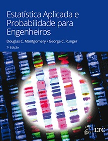
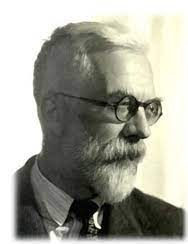

```{r setup, include=FALSE}
options(htmltools.dir.version = FALSE)
knitr::opts_chunk$set(echo = FALSE, 
                      comment = '',
                      message = FALSE,
                      warning = FALSE,
                      cache = TRUE)
```


class: center, middle

# Apresentação da disciplina

---

<style> 
#caixa {
  border: 1px solid;
  padding: 10px;
  box-shadow: 5px 10px blue;
}
div {
  text-align: justify;
  text-justify: inter-word;
}
</style>


# Apresentar-se

- Nome, o curso, o período

<br>

- Qual foi a sua motivação para matricular-se na disciplina?

```{r , echo=FALSE, fig.align = 'right', out.width = '60%'}
knitr::include_graphics('https://media.giphy.com/media/TKNGghpLhaz9XH1tSj/giphy.gif')
```

---

# Objetivo da disciplina &#127919;

<div id="caixa">
 <div>Estimular o <font color="#0066cc">senso crítico</font>do estudante com relação à experimentação, de tal modo que, recebendo informações a respeito da pesquisa, o estudante seja <font color="#0066cc">capaz de</font> :
 <ul>
  <li>planejar um experimento;</li>
  <li>conduzir o experimento;</li>
  <li>analisar os dados;</li>
  <li>interpretar os resultados.</li>
</ul>
 </div>
</div>

<br>

--

.pull-left[
Horário da Aula &#9200;
]
.pull-right[
- Terça-feira das 13:00--14:40

- **Tolerância**: 10 minutos
]

<br>

---

# Conteúdo Programático &#128214;

&#10004; Introdução à planejamento de experimentos

```{r , echo=FALSE, fig.align = 'right', out.width = '60%'}
knitr::include_graphics('https://media.giphy.com/media/v1.Y2lkPTc5MGI3NjExODg0NmZhOWRiYmUzOGYyNDdkNjQwYzJjMzFjZTlkNTUyZTA5NDhiMSZjdD1n/i0GlE1yskKkus/giphy.gif')
```

<br>

---

&#10004; Elaborar e conduzir um experimento

```{r , echo=FALSE, fig.align = 'right', out.width = '50%'}
knitr::include_graphics('https://media.giphy.com/media/v1.Y2lkPTc5MGI3NjExYzNkYTk5YzhkOGIwYTgyMzgwYWQxOWExYWNkZmY2ZjI0ZjJhMDhkMiZjdD1n/xLiuPwRKGGTUACgVX0/giphy.gif')
```

---

&#10004; Análise de experimentos

&#128187; *Software* R 

.pull-left[

```{r , echo=FALSE, fig.align = 'center', out.width = '80%'}

```

]
.pull-right[
```{r , echo=FALSE, fig.align = 'center', out.width = '70%'}
knitr::include_graphics('https://media.giphy.com/media/VbnUQpnihPSIgIXuZv/giphy.gif')
```
]

---

# Bibliografia básica &#128218;

&#10004; MONTGOMERY, Douglas C.; RUNGER, George C. **Estatística aplicada e probabilidade para engenheiros**. 7ed. Rio de Janeiro, RJ: LTC, 2021

```{r , echo=FALSE, fig.align = 'center', out.width = '35%'}

```

---

# Bibliografia básica &#128218;

&#10004; Lawson, John. **Design and Analysis of Experiments with R**. Boca Raton: Chapman & Hall, 2014.

```{r , echo=FALSE, fig.align = 'center', out.width = '35%'}
knitr::include_graphics('figuras/fig8.jpg')
```

---

# Complementação de carga horária

.pull-left[
&#10004; Quizzes sobre os conceitos teóricos e aplicações.

&#10004; Leitura de material complementar.

&#10004; Utilização do *software* R.

&#10004; Redação de relatório. 
]
.pull-right[

```{r , echo=FALSE, fig.align = 'right', out.width = '60%'}
knitr::include_graphics('https://media.giphy.com/media/1oBwBVLGoLteCP2kyD/giphy.gif')
```
]

<br>

--

&#128680;

&#10004; Vocês são **encorajados** a resolver problemas com os outros estudantes, compartilhar e discutir ideias.

&#10004; As respostas de cada problema devem ser **resultados de seu próprio esforço**.

---

# Critério de avaliação &#9997;

&#10004; Será aprovado o aluno que obtiver nota final maior ou igual a 6 $(NF\geq6)$, em que
		$$NF=0,2N1+0,8N2,$$
em que $N1$ é a nota final das atividades assíncronas e $N2$ é a nota final do artigo relatório.

<br>

--

&#10004; O aluno com $NF<6$ deverá fazer a prova de recuperação (avaliação dissertativa) no dia 07-07-2023.

A nota final será recalculada por 
$$NFr=\frac{NF+NR}{2},$$ 
em que $NR$ é a nota da prova de recuperação.

---

# Cópia de trabalhos (e/ou *internet*) é falsidade

```{r , echo=FALSE, fig.align = 'center', out.width = '40%'}
knitr::include_graphics('https://media.giphy.com/media/SRqTQmbYdm5jgS7xH9/giphy.gif
')
```

A desonestidade em nosso trabalho acadêmico representa uma **grave violação ética**.

<br>

Para maiores detalhes, consulte o **regulamento disciplinar do corpo discente da UTFPR**

<https://portal.utfpr.edu.br/documentos/graduacao-e-educacao-profissional/prograd/diretrizes-e-regulamentos/gestao/regulamento-disciplinar-do-corpo-discente/view>

---

# Espera-se do aluno 

&#10004; Base de Probabilidade de Estatística


&#10004; Base computacional.


&#10004; Pró-ativo.

```{r , echo=FALSE, fig.align = 'center', out.width = '50%'}
knitr::include_graphics('https://media.giphy.com/media/KM9Oag1SJ7PiyoWUEW/giphy.gif')
```

---


# 

&#10004; <https://moodle.utfpr.edu.br/login/index.php>

<br>

&#10004; Londrina - Graduação - Engenharia Química - Disciplinas Optativas/Eletivas

<br>

&#10004; Disciplina: 2023 - S1 - Planejamento e análise de experimentos: teoria e prática

<br>

.pull-left[
&#10004; Senha: OP68B2023
]
.pull-right[
```{r , echo=FALSE, fig.align = 'left', out.width = '80%'}
knitr::include_graphics('https://media.giphy.com/media/IoP0PvbbSWGAM/giphy.gif')
```
]

---

class: center, middle

# Introdução

---

# O papel da Estatística em Engenharia

<fieldset class="fldsetexample-class">
  <legend class="legendexample-class">
    Engenheiro
  </legend>
 <font color="white"> 
 pessoa que resolve problemas de interesse da sociedade, pela aplicação eficiente dos princípios científicos.</font>
</fieldset>

```{r , echo=FALSE, fig.align = 'center', out.width = '60%'}
knitr::include_graphics('https://media.giphy.com/media/yv1ggi3Cbase05a8iS/giphy.gif')
```

---

# O papel da Estatística em Engenharia

<fieldset class="fldsetexample-class">
  <legend class="legendexample-class">
    Engenheiro
  </legend>
  
 pessoa que resolve problemas de interesse da sociedade, pela aplicação eficiente dos princípios científicos.
</fieldset>

```{r , echo=FALSE, fig.align = 'center', out.width = '60%'}
knitr::include_graphics('https://media.giphy.com/media/yv1ggi3Cbase05a8iS/giphy.gif')
```

---

<fieldset class="fldsetexample-class">
  <legend class="legendexample-class">
    Estatística
  </legend>
 <font color="white"> 
 pessoa que resolve problemas de interesse da sociedade, pela aplicação eficiente dos princípios científicos.</font>
</fieldset>

```{r , echo=FALSE, fig.align = 'center', out.width = '40%'}
knitr::include_graphics('https://media.giphy.com/media/LaVp0AyqR5bGsC5Cbm/giphy.gif')
```

---

<fieldset class="fldsetexample-class">
  <legend class="legendexample-class">
    Estatística
  </legend>
   ciência que se dedica a coleta, análise e interpretação dos dados.
</fieldset>

```{r , echo=FALSE, fig.align = 'center', out.width = '40%'}
knitr::include_graphics('https://media.giphy.com/media/LaVp0AyqR5bGsC5Cbm/giphy.gif')
```

<br>
--

<fieldset class="fldsetalert-class">
  <legend class="legendalert-class">
    Qual o papel da Estatística na Engenharia?
  </legend>
  <font color="white"> 
 pessoa que resolve problemas de interesse da sociedade, pela aplicação eficiente dos princípios científicos. pessoa que resolve problemas de interesse da sociedade, pela aplicação eficiente dos princípios científicos</font>
</fieldset>

---

<fieldset class="fldsetexample-class">
  <legend class="legendexample-class">
    Estatística
  </legend>
   ciência que se dedica a coleta, análise e interpretação dos dados.
</fieldset>

```{r , echo=FALSE, fig.align = 'center', out.width = '40%'}
knitr::include_graphics('https://media.giphy.com/media/LaVp0AyqR5bGsC5Cbm/giphy.gif')
```

<br>


<fieldset class="fldsetalert-class">
  <legend class="legendalert-class">
    Qual o papel da Estatística na Engenharia?
  </legend>

 Fornecer **métodos estatísticos** para engenharia tomar decisões e resolver problemas.
</fieldset>

---

O **método científico** consiste na aplicação iterativa dos seguintes passos:

--

- Observar o **estado da natureza**;

<br>

--

- **conjecturar** o fenômeno para o que foi observado;

<br>

--

- coletar os **dados**;

<br>

--

- **analisar** os dados para confirmar ou rejeitar a conjectura.

<br>

```{r , echo=FALSE, fig.align = 'center', out.width = '35%'}
knitr::include_graphics('figuras/metodo.jpg')
```

---

Os dados, geralmente, são **coletados** por meio de:

--

<fieldset class="fldsetexample-class">
  <legend class="legendexample-class">
    Levantamento
  </legend>
 <font color="white"> 
 pessoa que resolve problemas de interesse da sociedade, pela aplicação eficiente dos princípios científicos. pessoa que resolve problemas de interesse da sociedade, pela aplicação eficiente dos princípios científicos</font>
</fieldset>

---
Os dados, geralmente, são **coletados** por meio de:

<fieldset class="fldsetexample-class">
  <legend class="legendexample-class">
    Levantamento
  </legend>

 utilizada quando o objetivo da coleta de dados é estimar alguma propriedade de uma população finita.
</fieldset>

<br>

--

<fieldset class="fldsetexample-class">
  <legend class="legendexample-class">
    Estudo observacional
  </legend>
 <font color="white"> 
 pessoa que resolve problemas de interesse da sociedade, pela aplicação eficiente dos princípios científicos. pessoa que resolve problemas de interesse da sociedade, pela aplicação eficiente dos princípios científicos</font>
</fieldset>

---

Os dados, geralmente, são **coletados** por meio de:

<fieldset class="fldsetexample-class">
  <legend class="legendexample-class">
    Levantamento
  </legend>

 utilizada quando o objetivo da coleta de dados é estimar alguma propriedade de uma população finita.
</fieldset>

<br>


<fieldset class="fldsetexample-class">
  <legend class="legendexample-class">
    Estudo observacional
  </legend>

 são normalmente utilizados para determinar a relação entre duas ou mais quantidades medidas em uma população conceitual. Os dados são observados em seu **ambiente natural**.
</fieldset>

<br>

--

<fieldset class="fldsetexample-class">
  <legend class="legendexample-class">
    Experimentos
  </legend>
 <font color="white"> 
 pessoa que resolve problemas de interesse da sociedade, pela aplicação eficiente dos princípios científicos. pessoa que resolve problemas de interesse da sociedade, pela aplicação eficiente dos princípios científicos</font>
</fieldset>

---

Os dados, geralmente, são **coletados** por meio de:

<fieldset class="fldsetexample-class">
  <legend class="legendexample-class">
    Levantamento
  </legend>

 utilizada quando o objetivo da coleta de dados é estimar alguma propriedade de uma população finita.
</fieldset>

<br>


<fieldset class="fldsetexample-class">
  <legend class="legendexample-class">
    Estudo observacional
  </legend>

 são normalmente utilizados para determinar a relação entre duas ou mais quantidades medidas em uma população conceitual. Os dados são observados em seu **ambiente natural**.
</fieldset>

<br>

<fieldset class="fldsetexample-class">
  <legend class="legendexample-class">
    Experimentos
  </legend>
 são normalmente utilizados para determinar a relação entre duas ou mais quantidades medidas em uma população conceitual. Os dados são observados em um **ambiente controlado**.
</fieldset>

---

Os dados, geralmente, são **coletados** por meio de:

<fieldset class="fldsetexample-class">
  <legend class="legendexample-class">
    Levantamento
  </legend>

 utilizada quando o objetivo da coleta de dados é estimar alguma propriedade de uma população finita.
</fieldset>

<br>


<fieldset class="fldsetexample-class">
  <legend class="legendexample-class">
    Estudo observacional
  </legend>

 são normalmente utilizados para determinar a relação entre duas ou mais quantidades medidas em uma população conceitual.  Os dados são observados em seu **ambiente natural**.
</fieldset>

<br>

<fieldset class="fldsetalert-class">
  <legend class="legendalert-class">
    Experimentos
  </legend>
 pessoa que resolve problemas de interesse da sociedade, pela aplicação eficiente dos princípios científicos. Os dados são observados em um **ambiente controlado**. 
</fieldset>

---

# Experimentos estatisticamente planejados

Em experimentação, o **planejamento cuidadoso** e **execução** do plano são passos muito importantes.

--

.pull-left[
&#10004; Fisher teve as ideias para planejamento e análise de experimentos usadas como base para validade inferencial.
]
.pull-right[

```{r , echo=FALSE, fig.align = 'center', out.width = '60%'}

```
]

--

&#128680; **Desafios**:

- grande quantidade de variação;

--

- experimentos eram caros e demorados.

---

<fieldset class="fldsetexample-class">
  <legend class="legendexample-class">
    Motivação de Fisher
  </legend>

 encontrar técnicas que podem:
</fieldset>

--

- eliminar o máximo possível de variação natural.

<br>

--

- evitar que variações não removidas confundam ou viciem os efeitos que estão sendo testados.

<br>

--

- detectar causa e efeito.

---

```{r , echo=FALSE, fig.align = 'center', out.width = '90%'}
knitr::include_graphics('figuras/passos.jpg')
```

---

# Próxima aula


<div id="caixa">
 <div>Conceitos básicos de planejamento de experimentos.
 </div>
</div>

