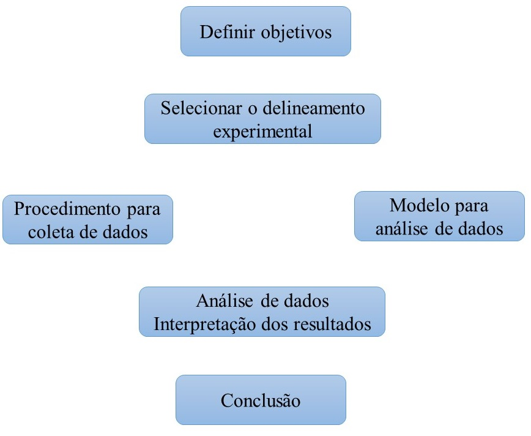

```{r setup, include=FALSE}
options(htmltools.dir.version = FALSE)
knitr::opts_chunk$set(echo = FALSE, 
                      comment = '',
                      message = FALSE,
                      warning = FALSE,
                      cache = TRUE)
```

<style> 
#caixa {
  border: 1px solid;
  padding: 10px;
  box-shadow: 5px 10px blue;
}
div {
  text-align: justify;
  text-justify: inter-word;
}
</style>


# O papel da Estatística em Engenharia

<fieldset class="fldsetexample-class">
  <legend class="legendexample-class">
    Engenheiro
  </legend>
 <font color="white"> 
 pessoa que resolve problemas de interesse da sociedade, pela aplicação eficiente dos princípios científicos.</font>
</fieldset>

```{r , echo=FALSE, fig.align = 'center', out.width = '60%'}
knitr::include_graphics('https://media.giphy.com/media/yv1ggi3Cbase05a8iS/giphy.gif')
```

---

# O papel da Estatística em Engenharia

<fieldset class="fldsetexample-class">
  <legend class="legendexample-class">
    Engenheiro
  </legend>
  
 pessoa que resolve problemas de interesse da sociedade, pela aplicação eficiente dos princípios científicos.
</fieldset>

```{r , echo=FALSE, fig.align = 'center', out.width = '60%'}
knitr::include_graphics('https://media.giphy.com/media/yv1ggi3Cbase05a8iS/giphy.gif')
```

---

<fieldset class="fldsetexample-class">
  <legend class="legendexample-class">
    Estatística
  </legend>
 <font color="white"> 
 pessoa que resolve problemas de interesse da sociedade, pela aplicação eficiente dos princípios científicos.</font>
</fieldset>

```{r , echo=FALSE, fig.align = 'center', out.width = '40%'}
knitr::include_graphics('https://media.giphy.com/media/LaVp0AyqR5bGsC5Cbm/giphy.gif')
```

---

<fieldset class="fldsetexample-class">
  <legend class="legendexample-class">
    Estatística
  </legend>
   ciência que se dedica a coleta, análise e interpretação dos dados.
</fieldset>

```{r , echo=FALSE, fig.align = 'center', out.width = '40%'}
knitr::include_graphics('https://media.giphy.com/media/LaVp0AyqR5bGsC5Cbm/giphy.gif')
```

<br>
--

<fieldset class="fldsetalert-class">
  <legend class="legendalert-class">
    Qual o papel da Estatística na Engenharia?
  </legend>
  <font color="white"> 
 pessoa que resolve problemas de interesse da sociedade, pela aplicação eficiente dos princípios científicos. pessoa que resolve problemas de interesse da sociedade, pela aplicação eficiente dos princípios científicos</font>
</fieldset>

---

<fieldset class="fldsetexample-class">
  <legend class="legendexample-class">
    Estatística
  </legend>
   ciência que se dedica a coleta, análise e interpretação dos dados.
</fieldset>

```{r , echo=FALSE, fig.align = 'center', out.width = '40%'}
knitr::include_graphics('https://media.giphy.com/media/LaVp0AyqR5bGsC5Cbm/giphy.gif')
```

<br>


<fieldset class="fldsetalert-class">
  <legend class="legendalert-class">
    Qual o papel da Estatística na Engenharia?
  </legend>

 Fornecer **métodos estatísticos** para engenharia tomar decisões e resolver problemas.
</fieldset>

---

O **método científico** consiste na aplicação iterativa dos seguintes passos:

--

- Observar o **estado da natureza**;

<br>

--

- **conjecturar** o fenômeno para o que foi observado;

<br>

--

- coletar os **dados**;

<br>

--

- **analisar** os dados para confirmar ou rejeitar a conjectura.

<br>

```{r , echo=FALSE, fig.align = 'center', out.width = '35%'}

```

---

Os dados, geralmente, são **coletados** por meio de:

--

<fieldset class="fldsetexample-class">
  <legend class="legendexample-class">
    Levantamento
  </legend>
 <font color="white"> 
 pessoa que resolve problemas de interesse da sociedade, pela aplicação eficiente dos princípios científicos. pessoa que resolve problemas de interesse da sociedade, pela aplicação eficiente dos princípios científicos</font>
</fieldset>

---
Os dados, geralmente, são **coletados** por meio de:

<fieldset class="fldsetexample-class">
  <legend class="legendexample-class">
    Levantamento
  </legend>

 utilizada quando o objetivo da coleta de dados é estimar alguma propriedade de uma população finita.
</fieldset>

<br>

--

<fieldset class="fldsetexample-class">
  <legend class="legendexample-class">
    Estudo observacional
  </legend>
 <font color="white"> 
 pessoa que resolve problemas de interesse da sociedade, pela aplicação eficiente dos princípios científicos. pessoa que resolve problemas de interesse da sociedade, pela aplicação eficiente dos princípios científicos</font>
</fieldset>

---

Os dados, geralmente, são **coletados** por meio de:

<fieldset class="fldsetexample-class">
  <legend class="legendexample-class">
    Levantamento
  </legend>

 utilizada quando o objetivo da coleta de dados é estimar alguma propriedade de uma população finita.
</fieldset>

<br>


<fieldset class="fldsetexample-class">
  <legend class="legendexample-class">
    Estudo observacional
  </legend>

 são normalmente utilizados para determinar a relação entre duas ou mais quantidades medidas em uma população conceitual. Os dados são observados em seu **ambiente natural**.
</fieldset>

<br>

--

<fieldset class="fldsetexample-class">
  <legend class="legendexample-class">
    Experimentos
  </legend>
 <font color="white"> 
 pessoa que resolve problemas de interesse da sociedade, pela aplicação eficiente dos princípios científicos. pessoa que resolve problemas de interesse da sociedade, pela aplicação eficiente dos princípios científicos</font>
</fieldset>

---

Os dados, geralmente, são **coletados** por meio de:

<fieldset class="fldsetexample-class">
  <legend class="legendexample-class">
    Levantamento
  </legend>

 utilizada quando o objetivo da coleta de dados é estimar alguma propriedade de uma população finita.
</fieldset>

<br>


<fieldset class="fldsetexample-class">
  <legend class="legendexample-class">
    Estudo observacional
  </legend>

 são normalmente utilizados para determinar a relação entre duas ou mais quantidades medidas em uma população conceitual. Os dados são observados em seu **ambiente natural**.
</fieldset>

<br>

<fieldset class="fldsetexample-class">
  <legend class="legendexample-class">
    Experimentos
  </legend>
 são normalmente utilizados para determinar a relação entre duas ou mais quantidades medidas em uma população conceitual. Os dados são observados em um **ambiente controlado**.
</fieldset>

---

Os dados, geralmente, são **coletados** por meio de:

<fieldset class="fldsetexample-class">
  <legend class="legendexample-class">
    Levantamento
  </legend>

 utilizada quando o objetivo da coleta de dados é estimar alguma propriedade de uma população finita.
</fieldset>

<br>


<fieldset class="fldsetexample-class">
  <legend class="legendexample-class">
    Estudo observacional
  </legend>

 são normalmente utilizados para determinar a relação entre duas ou mais quantidades medidas em uma população conceitual.  Os dados são observados em seu **ambiente natural**.
</fieldset>

<br>

<fieldset class="fldsetalert-class">
  <legend class="legendalert-class">
    Experimentos
  </legend>
 pessoa que resolve problemas de interesse da sociedade, pela aplicação eficiente dos princípios científicos. Os dados são observados em um **ambiente controlado**. 
</fieldset>

---

# Experimentos estatisticamente planejados

Em experimentação, o **planejamento cuidadoso** e **execução** do plano são passos muito importantes.

--

.pull-left[
&#10004; Fisher teve as ideias para planejamento e análise de experimentos usadas como base para validade inferencial.
]
.pull-right[

```{r , echo=FALSE, fig.align = 'center', out.width = '60%'}
knitr::include_graphics('figuras/fisher.jpg')
```
]

--

&#128680; **Desafios**:

- grande quantidade de variação;

--

- experimentos eram caros e demorados.

---

<fieldset class="fldsetexample-class">
  <legend class="legendexample-class">
    Motivação de Fisher
  </legend>

 encontrar técnicas que podem:
</fieldset>

--

- eliminar o máximo possível de variação natural.

<br>

--

- evitar que variações não removidas confundam ou viciem os efeitos que estão sendo testados.

<br>

--

- detectar causa e efeito.

---

```{r , echo=FALSE, fig.align = 'center', out.width = '90%'}

```

---

# Próxima aula


<div id="caixa">
 <div>Princípios básicos da experimentação
 </div>
</div>

