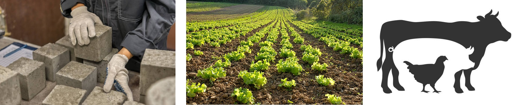

```{r setup, include=FALSE}
options(htmltools.dir.version = FALSE)
knitr::opts_chunk$set(echo = FALSE, 
                      comment = '',
                      message = FALSE,
                      warning = FALSE,
                      cache = TRUE)
```

<style> 
#caixa1 {
  border: 1px solid;
  padding: 10px;
  box-shadow: 5px 10px blue;
  font-size: 20pt;
}
#caixa2 {
  border: 1px solid;
  padding: 10px;
  box-shadow: 5px 10px green;
  font-size: 20pt;
}
div {
  text-align: justify;
  text-justify: inter-word;
}
</style>

# Aula Passada

---

# Objetivo da Aula &#127919;

.pull-left[
```{r , echo=FALSE, fig.align = 'right', out.width = '110%'}
knitr::include_graphics('https://media.giphy.com/media/ysyMmtuCA0AK9diW0I/giphy.gif')
```
]
.pull-right[

&#128309; Apresentar os <b>termos chaves</b>.
{{content}}
]

--

&#128309; Exercícios para aplicar os conceitos aprendidos.

---

# Importância do Planejamento &#10024;

o Planejamento de Experimentos é um **conjunto de ferramentas** essenciais para:

--

- otimização de processos, 

--

- desenvolvimento de novos produtos,

--

- melhoria da qualidade dos produtos existentes, 

---

class: center, middle

# Principais termos utilizados em planejamento de experimentos

---

# &#9989; Experimento

<!---
<div id="caixa2">
   É uma ação em que o pesquisador muda pelo menos uma das variáveis que estão sendo estudadas e então observa ps efeito  de suas ações.
</div>
-->

<div id="caixa2">
   É uma série de execuções (<i>run</i>) nas quais mudanças intencionais são feitas nas variáveis que estão sendo estudadas para que possamos observar as alterações sobre a variável de saída.
</div>

---

# &#9989; Unidade experimental

<div id="caixa2">
   É o item do estudo sobre o qual algo é alterado.
</div>

--

<br>

```{r , echo=FALSE, fig.align = 'center', out.width = '120%'}

```

---

# &#9989; Unidade observacional

<div id="caixa2">
   É a unidade onde observa-se ou mede-se os dados do experimento.
</div>

---

# &#9989; Fator

<div id="caixa2">
   É a variável independente em estudo que está sendo controlada.
</div>
    	
---

# &#9989; Níveis

<div id="caixa2">
   São as divisões do fator definidas pelo pesquisador a fim de determinar o efeito que tem sobre a variável de saída.
</div>

<!--
O nível está sendo alterado de forma sistemática de execução para execução, a fim de determinar o efeito que tem na(s) resposta(s)
-->

---

# &#9989; Variável resposta

<div id="caixa2">
   É a característica da unidade experimental que é medida após cada execução (<i>run</i>).
</div>

---

# &#9989; Erro experimental 

<div id="caixa2">
   É a diferença entre a variável resposta para um experimento particular e a média de longo prazo de
todos os experimentos conduzidos nas mesmas configurações das variáveis independentes.
</div>

---

# &#9989; Fatores de incômodo

<div id="caixa2">
   É qualquer variável que não é de interesse primário para o estudo, mas ainda pode afetar o resultado do experimento.
</div>

<!--
Esses fatores podem criar variabilidade nos resultados e interferir na capacidade de detectar o efeito dos principais fatores de interesse.
-->

---


class: center, middle

# Extras

---

# &#9989; Confundimento

<div id="caixa2">
  É uma estratégia para reduzir o número de execuções (<i>run</i>) do experimento e consiste em <b>misturar</b> os efeitos de menor contribuição com outros fatores, por exemplo, os fatores de incômodo.
</div>

---

# &#9989; Variáveis de confusão

<div id="caixa2">
   É uma variável que o pesquisador desconhece ou não pode controlar, e que pode ter um efeito sobre o resultado do experimento. 
</div>

<!--
Em um projeto experimental bem planejado, o efeito dessas variáveis ocultas deve se equilibrar para não alterar a conclusão de um estudo.
-->

```{r, echo=FALSE, fig.align = 'center', out.width = '45%'}
knitr::include_graphics('figuras/espuria.jpg')
```
<p style="font-size: 50%;"><center>Fonte: CHG Integrated Wealth</center></p>

---

class: center, middle

# Exercícios

---

# Exercício 1 &#9997;

De acordo com o enunciado identifique:

- a unidade experimental;

- o fator e seus níveis;

- o fator de incômodo, se houver;

- a variável resposta.

---

# Exercício 1 &#9997;

Um experimento foi feito para determinar o efeito de quatro produtos  químicos diferentes sobre a resistência de um tecido. Esses produtos químicos são usados como parte do processo de acabamento, sob prensagem permanente. Além disso, cinco amostra de tecidos foram selecionadas e testando cada tipo de produto químico uma vez, em uma ordem aleatória, em cada amostra de tecido.

---

# Exercício 2 &#9997;

De acordo com o enunciado, identifique e classifique o fator em:

- efeito aleatório ou 

- efeito fixo,

justifique a classificação.

---

# Exercício 2 &#9997;

a) Um experimento foi realizado para avaliar a resistência do concreto à compressão em função de quatro técnicas diferentes de misturas.

<br>

b) Um artigo na revista *Journal of Quality Technology* descreve um experimento que investiga os efeitos, no brilho da polpa, de quatro produtos químicos de branqueamento. Esses quatro produtos químicos foram selecionados ao acaso, a partir de uma população de agentes potenciais para o branqueamento.

---

# Exercício 3 &#9997;

De acordo com o enunciado, identifique a unidade experimental e caso haja, a unidade observacional.

---

# Exercício 3 &#9997;

a) Um experimento foi conduzido para determinar se quatro temperaturas específicas de queima afetam a densidade de um certo tipo de tijolo. 

b) Um experimento foi conduzido para avaliar o efeito de três tipos de adubação sobre a quantidade de massa seca de raiz de uma determinada hortaliça. Nestas condições, uma horta foi divida em nove quadrados de igual tamanho e em cada quadrado, de forma aleatória, foi aplicado a abubação. Ao final do estudo, dez hortalicas foram retiradas de cada quadrado para avaliar a quantidade de massa seca.

---

# Referências &#128218;

```{r , echo=FALSE, fig.align = 'center', out.width = '40%'}

```

---

# Referências &#128218;

```{r , echo=FALSE, fig.align = 'center', out.width = '50%'}
knitr::include_graphics('figuras/fig7.jpg')
```

---

# Próxima aula


<div id="caixa1">
 <div>Princípios básicos da experimentação
 </div>
</div>


```{r , echo=FALSE, fig.align = 'center', out.width = '70%'}
knitr::include_graphics('https://media.giphy.com/media/v1.Y2lkPTc5MGI3NjExY2RkMjg1YTgwMjNhNjg5YTVjNTRlOTc0ZDc5ZmVhNGQ3NDEyMTBkYyZjdD1n/lD76yTC5zxZPG/giphy.gif')
```
