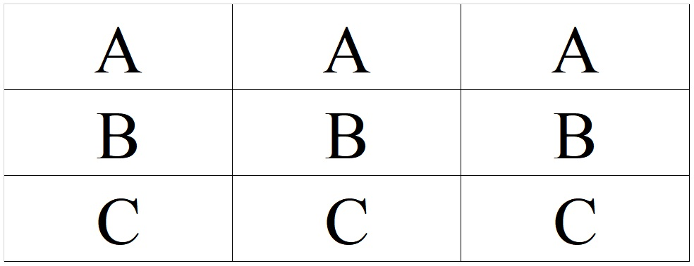
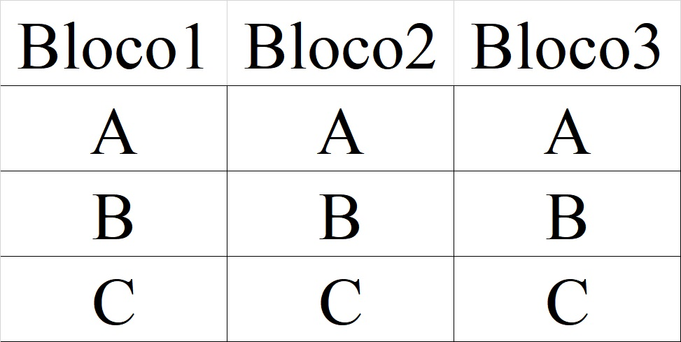

```{r setup, include=FALSE}
options(htmltools.dir.version = FALSE)
knitr::opts_chunk$set(echo = FALSE, 
                      comment = '',
                      message = FALSE,
                      warning = FALSE,
                      cache = TRUE)
```

<style> 
#caixa1 {
  border: 1px solid;
  padding: 10px;
  box-shadow: 5px 10px blue;
  font-size: 20pt;
}
#caixa2 {
  border: 1px solid;
  padding: 10px;
  box-shadow: 5px 10px green;
  font-size: 20pt;
}
div {
  text-align: justify;
  text-justify: inter-word;
}
/* Create three equal columns that floats next to each other */
.column {
  float: left;
  width: 30%;
  padding: 10px;
}

/* Clear floats after the columns */
.row:after {
  content: "";
  display: table;
  clear: both;
}
</style>

# Aula Passada

---

# Objetivo da Aula &#127919;

.pull-left[
```{r , echo=FALSE, fig.align = 'right', out.width = '110%'}
knitr::include_graphics('https://media.giphy.com/media/ysyMmtuCA0AK9diW0I/giphy.gif')
```
]
.pull-right[

&#128309; Compreender os <b>princípios básicos da experimentação</b>.
{{content}}
]

--

&#128309; Aplicar os princípios básicos da experimentação em exemplos práticos.

---

class: center, middle

# Princípios básicos da experimentação

---

# &#9989; Repetição

<div id="caixa2">
   Consiste em ter várias unidades experimentais com o mesmo nível de um fator ou mesma combinação de níveis (quando houver dois ou mais fatores).
</div>

<br>

<div class="row">
  <div class="column">
```{r , echo=FALSE, fig.align = 'right', out.width = '80%'}
knitr::include_graphics('https://media.giphy.com/media/3oEjHOUcNRKgpqTHiM/giphy.gif')
```
  </div>
  <div class="column">
    
```{r , echo=FALSE, fig.align = 'right', out.width = '80%'}
knitr::include_graphics('https://media.giphy.com/media/3oEjHOUcNRKgpqTHiM/giphy.gif')
```
  </div>
  <div class="column">
    
```{r , echo=FALSE, fig.align = 'right', out.width = '80%'}
knitr::include_graphics('https://media.giphy.com/media/3oEjHOUcNRKgpqTHiM/giphy.gif')
```
  </div>
</div>

---

# &#128680; Importância 

A repetição tem duas propriedades importantes:

- Permite obter uma estimativa do erro experimental.

- Permite obter estimativas mais precisas dos parâmetros de interesse.

---

# &#9989; Repetição

<div id="caixa1">
   Estudo em casa de vegetação para avaliar o efeito três tipos de solo (<i>S1, S2</i> e <i>S3</i>) no crescimento de soja.
</div>

---

# Número de repetições

- Capítulo 3 - 3.5.2 - Determining the Number of Replicates (página 70)

```{r , echo=FALSE, fig.align = 'center', out.width = '35%'}
knitr::include_graphics('figuras/fig8.jpg')
```

---

- **Método 1**

```{r, echo=TRUE, eval=FALSE}
# pacote
library(daewr)
# menor número de repetições
rmin <- 
# maior número de repetições
rmax <- 
# repetições
nreps <- c(rmin:rmax)
# nível de significância
alpha <-
# total de combinações
nlev <-
# estimativa do erro experimental
s <- 
# tamanho da diferença prática entre médias
Delta <- 
# poder do teste
poder <- Fpower1(alpha, nlev, nreps, Delta, s)
round(poder,5)
```

---

- **Método 1**: Exemplo de aplicação

<div id="caixa1">
   Um experimento de helicóptero de papel está planejado para investigar os efeitos de:
   <br>
   - quatro níveis do fator <i>A</i> = comprimento da asa e 
   <br>
   - quatro níveis do fator <i>B</i> = largura do corpo, 
<br>   
  ao longo do tempo de voo. Se experimentos-piloto
com nove repetições de um projeto resultou em tempos de voo de:
<br>
<center>2.8, 2.6, 3.5, 3.0, 3.1, 3.5, 3.2, 3.4 e 3.4</center> 
<br>
segundos. Quantas repetições seriam necessárias para
detectar uma diferença nos tempos de voo de 1 segundo com um poder de 0,90?
</div>

---

- **Método 1**: Exemplo de aplicação

```{r, echo=TRUE, eval=FALSE}
# pacote
library(daewr)
# menor número de repetições
rmin <- 2
# maior número de repetições
rmax <- 8
# repetições
nreps <- c(rmin:rmax)
# nível de significância
alpha <- 0.05
# total de combinações: 4x4
nlev <- 16
# estimativa do erro experimental (teste piloto)
s <- 0.32
# tamanho da diferença prática entre médias
Delta <- 1
# poder do teste
poder <- Fpower1(alpha, nlev, nreps, Delta, s)
round(poder,5)
```

---

- **Método 1**: Exemplo de aplicação

```{r, echo=FALSE, eval=TRUE}
# pacote
library(daewr)
# menor número de repetições
rmin <- 2
# maior número de repetições
rmax <- 8
# repetições
nreps <- c(rmin:rmax)
# nível de significância
alpha <- 0.05
# total de combinações: 4x4
nlev <- 16
# estimativa do erro experimental (teste piloto)
s <- 0.32
# tamanho da diferença prática entre médias
Delta <- 1
# poder do teste
poder <- Fpower1(alpha, nlev, nreps, Delta, s)
round(poder,5)
```

---

# &#9989; Aleatorização

<div id="caixa2">
   É a atribuição dos níveis do fator as unidades experimentais de modo que cada unidade tenha a mesma probabilidade de receber cada nível
</div>

```{r , echo=FALSE, fig.align = 'center', out.width = '30%'}
knitr::include_graphics('https://media.giphy.com/media/UQIlrgnV4ZOf3S0J81/giphy.gif')
```

---

# &#128680; Importância

A aleatorização é utilizada para:

- evitar o viés na seleção de grupos.

- evitar a correlação entre unidades experimentais adjacentes.

---

# &#9989; Aleatorização

<div id="caixa1">
   Estudo em casa de vegetação para avaliar o efeito três tipos de solo (<i>S1, S2</i> e <i>S3</i>) no crescimento de soja.
</div>
    	
---

# &#9989; Controle local

<div id="caixa2">
   Consiste no agrupamento de unidades experimentais em grupos denominados blocos, sendo as unidades dentro de um grupo tão semelhantes quanto possível.
</div>

<br>

```{r , echo=FALSE, fig.align = 'center', out.width = '60%'}
knitr::include_graphics('https://media.giphy.com/media/G2qi0ogzHYMVDfQoVb/giphy.gif')
```

---

# &#9989; Controle local

<div id="caixa2">
   Consiste no agrupamento de unidades experimentais em grupos denominados blocos, sendo as unidades dentro de um grupo tão semelhantes quanto possível.
</div>

<br>

<div class="row">
  <div class="column">
  <b>Fogo</b>
```{r , echo=FALSE, fig.align = 'center', out.width = '90%'}
knitr::include_graphics('https://media.giphy.com/media/bkQAAeOePeK3e/giphy.gif')
```
  </div>
  <div class="column">
    <b>Água</b>
```{r , echo=FALSE, fig.align = 'center', out.width = '90%'}
knitr::include_graphics('https://media.giphy.com/media/Wklt2njWsEQzS/giphy.gif')
```
  </div>
  <div class="column">
    <b>Elétrico</b>
```{r , echo=FALSE, fig.align = 'center', out.width = '90%'}
knitr::include_graphics('https://media.giphy.com/media/xx0JzzsBXzcMK542tx/giphy.gif')
```
  </div>
</div>

---

# &#128680; Importância

O controle local é utilizado para:

- reduzir ou eliminar a variabilidade transmitida por fatores de incômodos.

- reduzir o erro experimental.

---

# &#9989; Controle local

<div id="caixa1">
   Estudo em casa de vegetação para avaliar o efeito três tipos de solo (<i>S1, S2</i> e <i>S3</i>) no crescimento de soja. Na casa de vegetação há um umidificador de ambiente de frente para mesas.
</div>

---


class: center, middle

# Delineamentos experimentais simples

---

# &#128214; Delineamento completamente aleatorizado

<div id="caixa2">
  É aquele em que cada nível ocorre um número especificado, possivelmente desigual, de vezes.
</div>

---

# &#128214; Delineamento em blocos aleatorizados

<div id="caixa2">
   É aquele em que o número de unidades experimentais por bloco é igual ao número de níveis. Cada nível ocorre uma vez e apenas uma vez em cada bloco, sendo a ordem dos níveis dentro de um bloco ao acaso. 
</div>

---

# &#128214; Delineamento em quadrado latino

<div id="caixa2">
   É aquele em que cada nível ocorre uma vez e apenas uma vez em cada linha e cada coluna, de modo que os números de linhas, colunas e níveis sejam todos iguais.
</div>

---

class: center, middle

# Exercícios

---

# Exercício 1 &#9997;

Considere um experimento para avaliar três variedades de batatas quanto a sua produção em uma área experimental que possui um gradiente de fertilidade. Em cada croqui do experimento, verifique se os princípios básicos da experimentação foram aplicados corretamente.

---

- **Croqui 1**

```{r , echo=FALSE, fig.align = 'center', out.width = '60%'}

```

<br>

- **Croqui 2**

```{r , echo=FALSE, fig.align = 'center', out.width = '60%'}

```

---

# Exercício 2 &#9997;

De acordo com o enunciado, identifique qual delineamento foi utilizado:

- completamente aleatorizado

- em blocos

- quadrado latino

justifique a escolha

---

# Exercício 2 &#9997;

a) Considere um experimento para estudar o efeitos de seis drogas $(A,B,C,D,E,F)$ sobre o tempo de reação de indivíduos às drogas. Sabendo que as reações individuais podem ser diferentes e a ordem de administração das drogas afeta a resposta, temos então, dois fatores de incômodo (indivíduo e ordem) e um fator de interesse (droga).

---

b) Um artigo no periódico *Lubrification Engineering* descreveu os resultados de  um experimento planejado para investigar os efeitos das propriedades de materiais à base de carbono sobre a evolução de defeitos na superfície de lacres desses materiais. Esses lacres são usados extensivamente em equipamentos como aqueles usados na partida de turbina de ar. Quatro materiais diferentes de carbono $(EC10, EC10A, EC4, EC1)$ foram testados e a rugosidade da superfície do lacre foi medida.

---

# Referências &#128218;

```{r , echo=FALSE, fig.align = 'center', out.width = '40%'}
knitr::include_graphics('figuras/fig8.jpg')
```

---

# Referências &#128218;

```{r , echo=FALSE, fig.align = 'center', out.width = '50%'}
knitr::include_graphics('figuras/fig7.jpg')
```

---

# Próxima aula


<div id="caixa1">
 <div>Experimentos fatoriais e análise de variância
 </div>
</div>


```{r , echo=FALSE, fig.align = 'center', out.width = '70%'}
knitr::include_graphics('https://media.giphy.com/media/v1.Y2lkPTc5MGI3NjExY2RkMjg1YTgwMjNhNjg5YTVjNTRlOTc0ZDc5ZmVhNGQ3NDEyMTBkYyZjdD1n/lD76yTC5zxZPG/giphy.gif')
```
