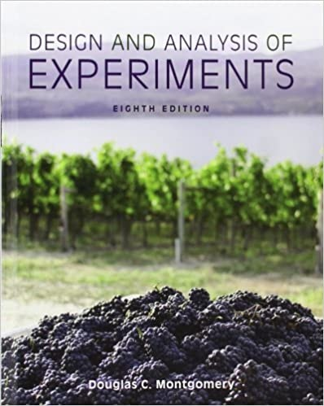
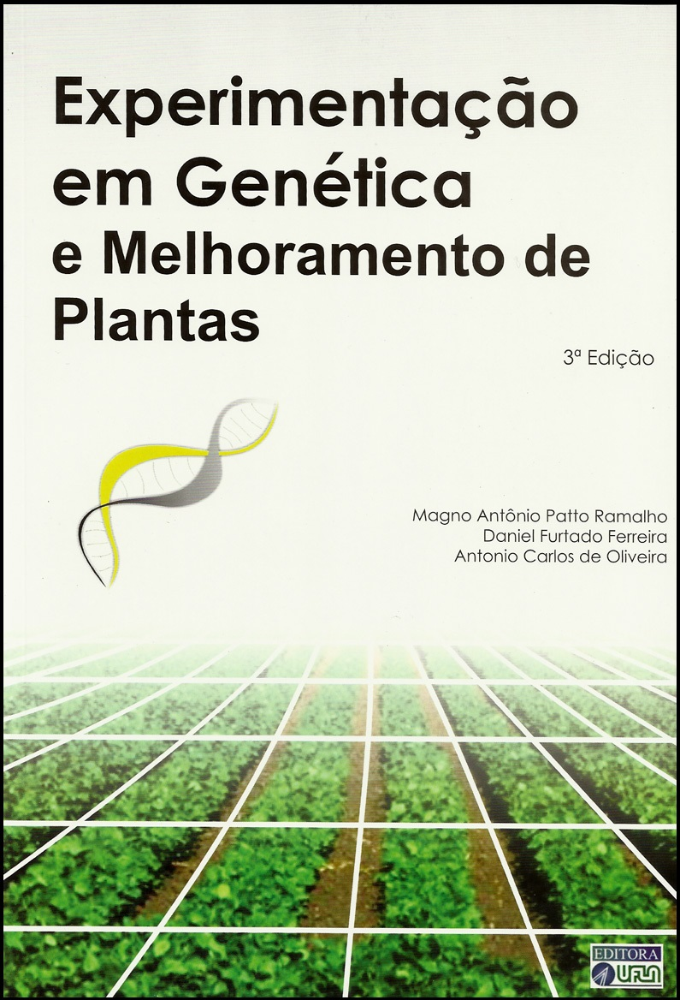

```{r setup, include=FALSE}
options(htmltools.dir.version = FALSE)
knitr::opts_chunk$set(echo = FALSE, 
                      comment = '',
                      message = FALSE,
                      warning = FALSE,
                      cache = TRUE)
```

<style> 
#caixa1 {
  border: 1px solid;
  padding: 10px;
  box-shadow: 5px 10px blue;
  font-size: 20pt;
}
#caixa2 {
  border: 1px solid;
  padding: 10px;
  box-shadow: 5px 10px green;
  font-size: 20pt;
}
div {
  text-align: justify;
  text-justify: inter-word;
}
/* Create three equal columns that floats next to each other */
.column {
  float: left;
  width: 30%;
  padding: 10px;
}

/* Clear floats after the columns */
.row:after {
  content: "";
  display: table;
  clear: both;
}
</style>

# Aula Passada

---

# Objetivo da Aula &#127919;

.pull-left[
```{r , echo=FALSE, fig.align = 'right', out.width = '110%'}
knitr::include_graphics('https://media.giphy.com/media/ysyMmtuCA0AK9diW0I/giphy.gif')
```
]
.pull-right[

&#128309; Definir experimentos em esquema <b>fatorial</b>.
{{content}}
]

--

&#128309; Análise de variância (ANOVA)

---

# Importância

---

class: center, middle

# Experimentos em Esquema Fatorial

---

# &#9989; Definição

<div id="caixa2">
   Consiste em ter várias unidades experimentais com o mesmo nível de um fator ou mesma combinação de níveis (quando houver dois ou mais fatores).
</div>

---

# &#9989; ANOVA

<div id="caixa2">
   É a atribuição dos níveis do fator as unidades experimentais de modo que cada unidade tenha a mesma probabilidade de receber cada nível
</div>

---

class: center, middle

# Exercícios

---

# Exercício 1 &#9997;

Faça uma ANOVA

---

# Referências &#128218;

```{r , echo=FALSE, fig.align = 'center', out.width = '40%'}
knitr::include_graphics('figuras/fig8.jpg')
```

---

# Referências &#128218;

```{r , echo=FALSE, fig.align = 'center', out.width = '50%'}

```

---

# Referências &#128218;

```{r , echo=FALSE, fig.align = 'center', out.width = '40%'}

```

---

# Próxima aula


<div id="caixa1">
 <div>Teste de Tukey e análise de resíduos
 </div>
</div>


```{r , echo=FALSE, fig.align = 'center', out.width = '70%'}
knitr::include_graphics('https://media.giphy.com/media/v1.Y2lkPTc5MGI3NjExY2RkMjg1YTgwMjNhNjg5YTVjNTRlOTc0ZDc5ZmVhNGQ3NDEyMTBkYyZjdD1n/lD76yTC5zxZPG/giphy.gif')
```
