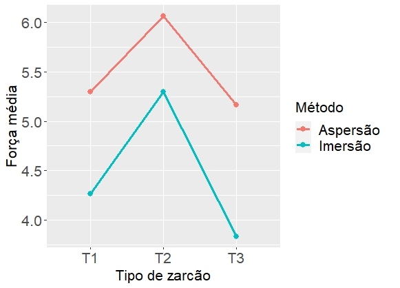

```{r setup, include=FALSE}
options(htmltools.dir.version = FALSE)
knitr::opts_chunk$set(echo = FALSE, 
                      comment = '',
                      message = FALSE,
                      warning = FALSE,
                      cache = TRUE)
```

<style> 
#caixa1 {
  border: 1px solid;
  padding: 10px;
  box-shadow: 5px 10px blue;
  font-size: 20pt;
}
#caixa2 {
  border: 1px solid;
  padding: 10px;
  box-shadow: 5px 10px green;
  font-size: 20pt;
}
div {
  text-align: justify;
  text-justify: inter-word;
}
/* Create three equal columns that floats next to each other */
.column {
  float: center;
  width: 30%;
  padding: 10px;
}

/* Clear floats after the columns */
.row:after {
  content: "";
  display: table;
  clear: both;
}
p.big {
  line-height: 0.75;
}
</style>

# Aula Passada

- Definição de experimentos em esquema fatoriais

--

- Modelos lineares da forma $Y=f(\cdot)+\varepsilon$

--

- Descrição da ANOVA

---

# Objetivo da Aula &#127919;

.pull-left[
```{r , echo=FALSE, fig.align = 'right', out.width = '110%'}
knitr::include_graphics('https://media.giphy.com/media/ysyMmtuCA0AK9diW0I/giphy.gif')
```
]
.pull-right[

&#128309; <b>Terminar</b> a ANOVA.
{{content}}
]

--

&#128309; Teste de comparação múltipla: <b>teste de Tukey</b>.
{{content}}

--

&#128309; <b>Interpretar</b> os resultados.
{{content}}

--

&#128309; Análise de <b>resíduos</b>.
{{content}}

--

&#128309; <b>Interpretar</b> os resultados.

---

class: center, middle

# Experimentos em Esquema Fatorial

---

# Exercício 1 &#9997;

<div id="caixa1">
   Um experimento no esquema fatorial 2x3 foi realizado para investigar o efeito do tipo de zarcão e do método de aplicação na adesão da tinta. Três espécimes foram pintados com cada um dos zarcões, usando cada um dos métodos de aplicação. Uma camada de tinta foi aplicada e a força de adesão foi medida. Os dados do experimento são apresentados na seguinte tabela.
</div>

<p class="big">
</p>

<table style="width:110%; font-size:140%">
  <tr>
    <th></th>
    <th colspan="2" align='center'>Método de aplicação</th>
  </tr>
  <tr>
    <th align="center">Tipo de zarcão</th>
    <th>Imersão</th>
    <th>Aspersão</th>
  </tr>
  <tr>
    <td align="center">1</td>
    <td>4.0, 4.5, 4.3</td>
    <td>5.4, 4.9, 5.6</td>
  </tr>
  <tr>
    <td align="center">2</td>
    <td>5.6, 4.9, 5.4</td>
    <td>5.8, 6.1, 6.3</td>
  </tr>
  <tr>
    <td align="center">3</td>
    <td>3.8, 3.7, 4.0</td>
    <td>5.5, 5.0, 5.0</td>
  </tr>
</table>

---

# Gráfico de interação

```{r , echo=FALSE, fig.align = 'center', out.width = '75%'}

```

---

<h2>ANOVA dos dados de zarcão de tinta</h2>

<table style='width:105%; font-size:130%'>
  <tr>
    <th align="center">Fonte de <br>variação</th>
    <th align="center">Grau de <br>liberdade</th>
    <th align="center">Soma de <br>quadrados</th>
    <th align="center">Quadrado <br>médio</th>
    <th align="center">Estatística <br>do teste</th>
  </tr>
  <tr>
    <td>Método de <br>aplicação</td>
    <td> </td>
    <td> </td>
    <td> </td>
    <td> </td>
  </tr>
  <tr>
    <td>Tipo de <br>zarcão</td>
    <td> </td>
    <td> </td>
    <td> </td>
    <td> </td>
  </tr>
  <tr>
    <td>Interação</td>
    <td> </td>
    <td> </td>
    <td> </td>
    <td> </td>
  </tr>
  <tr>
    <td>Resíduo</td>
    <td> </td>
    <td> </td>
    <td> </td>
    <td> </td>
  </tr>
  <tr>
    <td>Total</td>
    <td> </td>
    <td> </td>
    <td> </td>
    <td> </td>
  </tr>
</table>

---

# &#128187; Saída do *software*  R 

```{r}
library(readxl)
library(tidyverse)
dados <- read_xlsx("dados/dados_zarcao.xlsx")

```

```{r}
# modelo
ajuste <- lm(forca~metodo*tipo, data = dados)
```

```{r}
library(knitr)
library(kableExtra)
options(knitr.kable.NA = '---')

coluna1 <- c('Método', 'Tipo', 'Interação','Resíduo')
anova_out <- anova(ajuste) |> 
  as_tibble() |> 
  add_column(coluna1, .before = 'Df')

kable(anova_out, digits = 4,
             col.names = c('Fonte de variação',
                           'Graus de liberdade',
                           'Soma de quadrados',
                           'Quadrado médio',
                           'Estatística do teste',
                           'p-valor'),
             align = c('c')) |> 
  kable_styling(font_size = 25)
```

<p class="big">
</p>

--

* <p style="font-size:130%"><b><i>p</i>-valor</b></p>

<div id="caixa2">
   É o menor nível de significância que conduz à rejeição de <i>H<sub>0</sub></i>, com os dados fornecidos.
</div>

---

# &#128187; Saída do *software*  R 

```{r}
options(knitr.kable.NA = '---')

kable(anova_out, digits = 4,
             col.names = c('Fonte de variação',
                           'Graus de liberdade',
                           'Soma de quadrados',
                           'Quadrado médio',
                           'Estatística do tesete',
                           'p-valor'),
             align = c('c')) |> 
  kable_styling(font_size = 25)
```

<p class="big">
</p>


* <p style="font-size:130%"><b>Critério de rejeição</b></p>


Teste $\Upsilon$: rejeitar $H_0$ se $p$-valor for menor do que o nível de significância $\alpha$.


---

class: center, middle

# Verificação dos Pressupostos da ANOVA

---

# &#9989; Modelo linear

Seja $Y_1, Y_2, \ldots, Y_n$ uma amostra aleatória. Então,

$$Y_i=f(\cdot)+\varepsilon_i, \quad i=1,\ldots,n. \quad\quad\quad (1)$$

--

O erro aleatório segue as seguintes suposições:

- erros são **independentes**.

--

- erros seguem distribuição normal com **média** igual a zero e **variância** igual a $\sigma^2$.

--

- a variância é **constante**.

---

# &#9989; Resíduo do modelo

Sejam $y_1, y_2, \ldots, y_n$ os valores observados no experimento e $\hat{y}_1, \hat{y}_2, \ldots, \hat{y}_n$ os valores preditos pelo modelo **estimado**. Então, o **resíduo** dd modelo linear $(1)$ é dado por

$$e_i=y_i-\hat{y}_i, \quad i=1,2,\ldots,n.$$

--

* <p style="font-size:130%"><b>Resíduo padronizado</b></p>

$$rp_i=\frac{e_i}{\sqrt{QM_{R}(1-h_{ii})}}, \quad i=1,2,\ldots,n.$$

```{r}
# RSE é a raiz quadrada do QMR
# h_ii é o elemento da diagonal (leverage) da matriz de projeção ortognal.
```

---

# Exercício 2 - Pressupostos ANOVA &#9997;

<div id="caixa1">
   Dados de <b>zarcão de tinta</b>.
</div>

<p class="big">
</p>

* <p style="font-size:130%"><b>Resíduo padronizado</b></p>

```{r}
# resíduo
e <- residuals(ajuste)

# resíduo padronizado
rp <- rstandard(ajuste)

# resíduo padronizado manualmente
#hats <- hatvalues(ajuste)
#rse <- sqrt(deviance(ajuste)/df.residual(ajuste))
#rp1 <- e/(rse*sqrt(1 - hats))

yhat <- predict(ajuste)
df <- data.frame(Resposta = dados$forca,
                 Preditos = yhat,
                 Residuo = e,
                 Resi_pad = rp)
df |> 
  head() |> 
  kable(digits = 4, align = c('c'),
        caption = 'As seis primeiras linhas') |> 
  kable_styling(font_size = 20)
```

---

* <p style="font-size:130%"><b>Teste de homogeneidade de variâncias</b>: teste de Levene</p>

As hipóteses do teste são:

$H_0:$ a variância é constante $vs$

$H_1:$ a variância não é constante 

--

```{r}
library(car)
# Teste de homogeneidade de variâncias
lev <- leveneTest(forca~tipo*metodo, data = dados)
```

```{r}
df_lev <- data.frame(teste=c('Levene'),
                  estat=c(lev[[2]][[1]]),
                  pvalor=c(lev[[3]][[1]]))

knitr::kable(df_lev, col.names = c('Teste',
                           'Estatística',
                           'p-valor'),
             align = c('c'), digits = 4)
```

---

* <p style="font-size:130%"><b>Teste de normalidade</b>: teste de Shapiro-Wilks</p>

As hipóteses do teste são

$H_0:$ os resíduos seguem distribuição normal $vs$

$H_1:$ os resíduos seguem outra distribuição

--

```{r}
# Teste de normalidade
sw <- shapiro.test(rp)
```

```{r}
df_sw <- data.frame(teste=c('Shapiro-Wilk'),
                  estat=c(sw[[1]][[1]]),
                  pvalor=c(sw[[2]][[1]]))

kable(df_sw, col.names = c('Teste',
                           'Estatística',
                           'p-valor'),
             align = c('c'), digits = 4)
```

---

class: center, middle

# Teste de Comparação Múltipla

---

# &#9989; Teste de Tukey

<div id="caixa2">
   É um teste de hipótese utilizado para comparar todo e qualquer diferença entre duas médias. 
</div>

<br>

--

- As hipóteses do teste são

$H_0:$ as médias não são diferentes $vs$

$H_1:$ as médias são diferentes

--

- Fixar o nível de significância $\alpha$

---

# &#9989; Teste de Tukey

- Critério de rejeição

Teste $\Upsilon$: rejeitar $H_0$ se $d_j\geq\Delta, \quad j=1,2,\ldots,k,$
em que $k$ é o número de comparações dois à dois, $d_j=\hat{\mu}_i-\hat{\mu}_l \,(i\neq l)$ é a $j$-ésima diferença e  
$$\Delta=q\sqrt{\frac{QM_{R}}{r}}$$
é a diferença mínima significativa.

--

- Calcular as estatísticas do teste $d_j$.

--

- Conclusão

---

# Exercício 3 - Teste de Tukey &#9997;

<h2>ANOVA dos dados de zarcão de tinta</h2>

```{r}
options(knitr.kable.NA = '---')

kable(anova_out, digits = 4,
             col.names = c('Fonte de variação',
                           'Graus de liberdade',
                           'Soma de quadrados',
                           'Quadrado médio',
                           'Estatística do teste',
                           'p-valor'),
             align = c('c')) |> 
  kable_styling(font_size = 25)
```
  
---

# Teste de Tukey: método de aplicação &#9997;

```{r}
library(Rmisc)

df_metodo <- summarySE(dados, 
                     measurevar="forca", 
                     groupvars=c("metodo")) |> 
  arrange(forca) 

df_metodo |> 
  select(metodo,forca,se) |> 
  kable(digits = 4,
             col.names = c('Método de aplicação','Força média',
                           'Erro padrão'),
             align = c('c')) |> 
  kable_styling(font_size = 30)
```


---

# Teste de Tukey: tipo de zarcão &#9997;

As **hipóteses** do teste são

$H_0:$ as médias não são diferentes $vs$

$H_1:$ as médias são diferentes


<br>

--

<p style="font-size:130%">O <b>Critério de rejeição</b></p>


Teste $\Upsilon$: rejeitar $H_0$ se $d_j\geq \Delta=q\sqrt{\frac{QM_{R}}{r}}$

---

# Teste de Tukey: tipo de zarcão &#9997;

As **estatísticas do teste** são:

<br>
<br>
<br>
<br>

--

**Conclusão**

---

# Teste de Tukey: tipo de zarcão &#9997;

```{r}
df_tipo <- summarySE(dados, measurevar="forca",
                   groupvars=c("tipo")) |> 
  arrange(forca)

df_tipo |> 
  select(tipo,forca,se) |> 
  kable(digits = 4,
             col.names = c('Tipo','Força média',
                           'Erro padrão'),
             align = c('c')) |> 
  kable_styling(font_size = 25)
```

---

# Referências &#128218;

```{r , echo=FALSE, fig.align = 'center', out.width = '40%'}
knitr::include_graphics('figuras/fig9.jpg')
```

---

# Referências &#128218;

```{r , echo=FALSE, fig.align = 'center', out.width = '50%'}
knitr::include_graphics('figuras/fig7.jpg')
```

---

# Próximas aulas


<div id="caixa1">
 <div> Planejamento e condução de experimentos
 </div>
</div>


```{r , echo=FALSE, fig.align = 'center', out.width = '80%'}
knitr::include_graphics('https://media.giphy.com/media/v1.Y2lkPTc5MGI3NjExNmIyNjliMDQ5NjJjNmEzOWExYzNmMThmMDIyNjExOGVmYzMzN2UwYyZjdD1n/9uIjwFgumdKSw8gzpV/giphy.gif')
```
